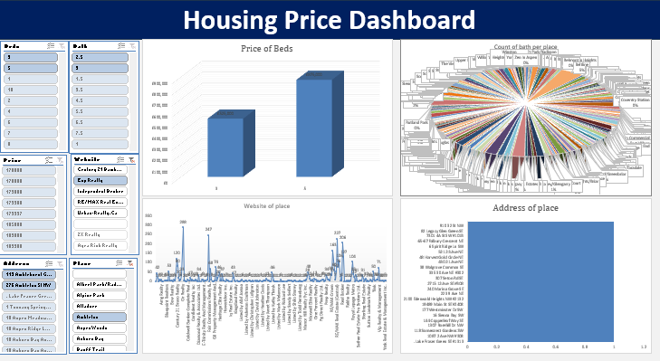

# Data Analytics Portfolio
# Project 1

**Title:** [Housing Price Interactive Sales Dashboard](https://github.com/Jamesdonuch/Jamesdonuch.github.io/blob/main/Housing%20Price%20Sales%20Dashboard.png)

**Tool Used:** Microsoft Excel (Pivot table, Pivot chart, Slicers and filters).

**Project Description:** This project involved analysing the housing price data to identify trends and patterns in sales performance. It is designed to provide a comprehensive overview of the key performance metrics. This dashboard allows stakeholders to easily monitor and analyse the housing price performance across different regions and periods.

**Key Findings:** Regional Profitability: Identified the most profitable countries and highlighted regions where performance could be improved. Sales Volatility: Analysed housing price fluctuations to understand market dynamics and adjust business strategies accordingly. This dashboard serves as a crucial tool for the housing price index, providing clear, actionable insights that drive informed decision-making and strategic planning.

**Dashboard Overview:**

# Project 2

**Title:** [Food Supply Report Dashboard](https://github.com/Jamesdonuch/Jamesdonuch.github.io/blob/main/Food%20supply%20report%20dashboard.pbix)

**Tool Used:** Microsoft PowerBI (Table view, Charts, Cards, Slicers and filters).

**Project Description:**

**Key Findings:**

**Dashboard Overview:**
[Foodsupplysalesreport](Foodsupplysalesreport.png)

